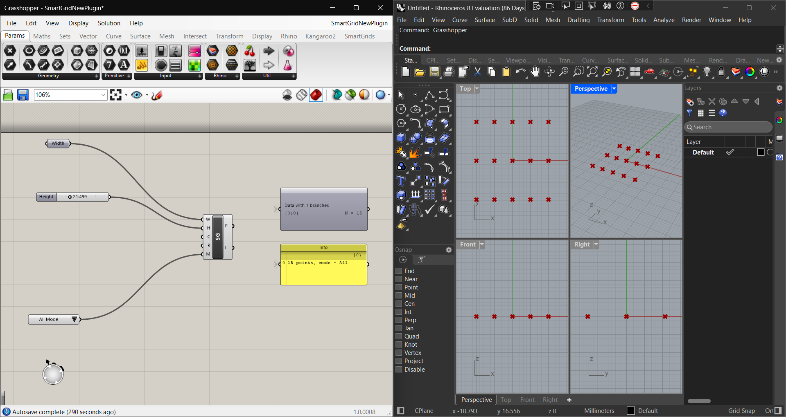
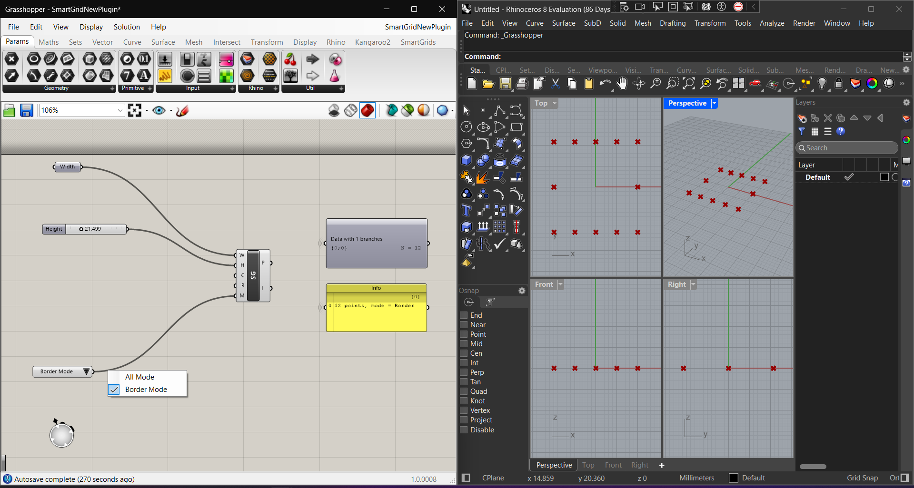

# SmartGrid – Grasshopper C# Component (Rhino3D-CAD App)

SmartGrid is a custom Grasshopper component that generates a rectangular grid of points on the XY-plane, with two selectable modes:

- **All** – use all grid points  
- **Border** – use only the outer frame of the grid  

It is implemented as a Grasshopper plugin in C# (.NET Framework) and compiled as a `.gha` library.

---

## 📸 Preview

### All Mode – Full Grid



> All interior and boundary points are generated.

### Border Mode – Frame Only



> Only the outer border points (first/last row and first/last column) are generated.

---

## 📦 Features

- Generates a **grid of points** over a rectangular area.
- Grid is **centered at the world origin** on the XY plane.
- Supports two modes:
  - `All` – every grid point
  - `Border` – only frame points
- Outputs:
  - **P** – list of `Point3d` grid points
  - **Info** – a short summary string, e.g. `“15 points, mode = Border”`

---

## 🧮 Inputs

| Name   | Type    | Default | Description                                                   |
|--------|---------|---------|---------------------------------------------------------------|
| Width  | Number  | 10.0    | Total width of the grid in X direction                       |
| Height | Number  | 6.0     | Total height of the grid in Y direction                      |
| Cols   | Integer | 5       | Number of columns (points along X)                           |
| Rows   | Integer | 3       | Number of rows (points along Y)                              |
| Mode   | Text    | "All"   | `"All"` for full grid, `"Border"` for frame-only grid points |

---

## 🔧 Outputs

| Name | Type        | Description                                   |
|------|-------------|-----------------------------------------------|
| P    | Point List  | List of generated grid points (`Point3d`)     |
| Info | Text        | Info string, e.g. `"15 points, mode = All"`   |

---

## 🧠 Grid Logic

1. The rectangle is centered at `(0,0,0)` on the XY plane.
2. Step sizes are computed as:
   - `xStep = width / (cols - 1)`
   - `yStep = height / (rows - 1)`
3. The bottom-left starting point is:
   - `xStart = -width / 2`
   - `yStart = -height / 2`
4. Nested loops over `rows` and `cols` generate each point:
   - `x = xStart + i * xStep`
   - `y = yStart + j * yStep`
5. In **Border** mode, only points where:
   - `i == 0`, `i == cols - 1`, `j == 0`, or `j == rows - 1` are kept.

---

## 🚀 Installation

1. **Build the project** in Visual Studio as a  
   **Class Library (.NET Framework)** targeting **.NET Framework 4.8**.
2. Ensure you reference:
   - `RhinoCommon.dll`
   - `Grasshopper.dll`
3. After building, rename the output `.dll` to `.gha` if needed, or configure the project to output `.gha` directly.
4. Copy the `.gha` file to your Grasshopper Libraries folder:

   **Windows:**
   ```text
   %AppData%\Grasshopper\Libraries
